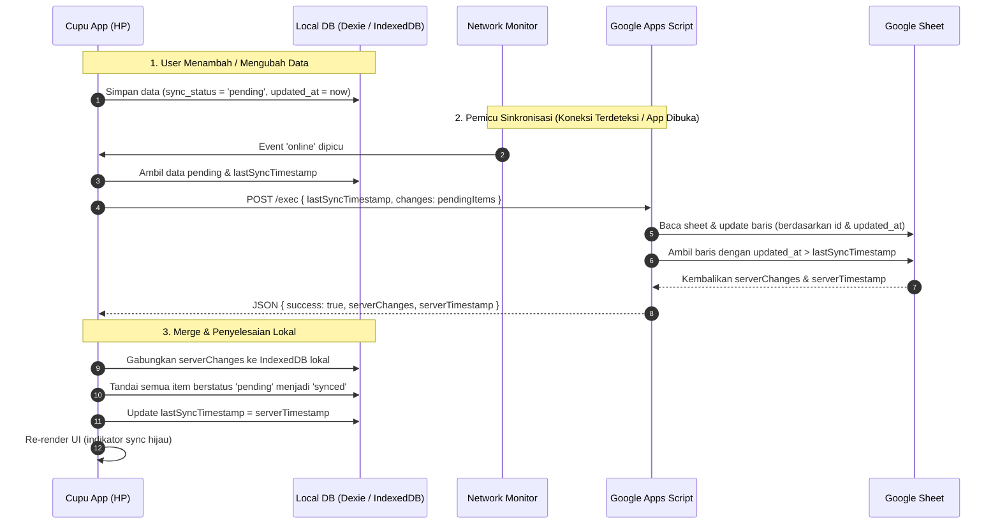

# Cupu Finance - Project Specification & Architecture Plan

Aplikasi pencatatan pengeluaran harian yang simpel, ringan, offline-first, dengan sinkronisasi dua arah (*two-way sync*) otomatis ke Google Sheets via Google Apps Script saat ada koneksi internet, serta rekapitulasi bulanan.

---

## 1. Ringkasan & Tujuan Produk

- **Super Ringan & Cepat**: Dibangun dengan SolidJS tanpa Virtual DOM dan minim dependensi pihak ketiga.
- **Offline-First**: Seluruh transaksi disimpan secara instan di database lokal HP (**IndexedDB** via `Dexie.js`) tanpa server.
- **Dual-Mode Two-Way Auto-Sync**: 
  - **Mode 1 (Umum / Siap Jual)**: *1-Klik Login Akun Google* (Google Drive & Sheets API). Otomatis mendeteksi/membuat file `Cupu Finance Data` di Google Drive user tanpa repot copy-paste script.
  - **Mode 2 (Power User / Kustom)**: *Custom Webhook URL Google Apps Script* bagi user yang ingin kontrol script sendiri tanpa login Google di app.
  - **Resolusi Konflik**: Menggunakan strategi *Last-Write-Wins* berdasarkan `updated_at`.
- **Rekap Bulanan Ringkas**:
  - Total pengeluaran per bulan.
  - Rincian nominal dan persentase per kategori dengan visual progress bar CSS ringan.
  - Pengelompokan riwayat transaksi per hari.

---

## 2. Tech Stack & Library

| Komponen | Pilihan Teknologi | Alasan |
|---|---|---|
| **Framework** | [SolidJS](https://www.solidjs.com/) (Vite + TypeScript) | Reaktivitas granular, performa sangat tinggi, ukuran bundle sangat kecil (~7KB). |
| **Mobile Runtime** | [Capacitor](https://capacitorjs.com/) | Wrapper native resmi, modern, ringan, mudah dikompilasi ke Android/iOS. |
| **Database Lokal (Offline-First)** | [Dexie.js](https://dexie.org/) (IndexedDB bawaan HP) | 100% lokal di HP tanpa server, tanpa batasan 5MB, kueri cepat dengan indexing untuk rekap bulanan. |
| **Preferensi Aplikasi** | `@capacitor/preferences` | Key-Value ringan untuk setting (mode sync, URL Web App, spreadsheet ID, token, currency). |
| **Google Sign-In (Mode 1)** | `@codetrix-studio/capacitor-google-auth` | Plugin native Capacitor resmi/populer untuk Google Sign-In & OAuth scope Drive/Sheets. |
| **Deteksi Jaringan** | `@capacitor/network` + Web Event (`online`/`offline`) | Auto-trigger sinkronisasi saat perangkat terhubung ke internet. |
| **Styling** | Tailwind CSS | Utility-first, purge CSS otomatis agar aset CSS akhir berukuran kecil. |
| **Backend Opsional (Mode 2)** | Google Apps Script (Web App) | Endpoint webhook mandiri untuk power user. |
| **Icons** | Lucide Icons (atau SVG inline) | Ikon ringkas dan hemat memori. |

---

## 3. Struktur Direktori Proyek

```text
cupu-finance/
├── android/                   # Generated Capacitor Android project
├── ios/                       # Generated Capacitor iOS project (jika dibutuhkan)
├── public/                    # Aset statis & favicon
├── src/
│   ├── assets/                # Logo / SVG / styles
│   ├── components/            # Komponen modular UI
│   │   ├── ExpenseForm.tsx    # Form cepat catat transaksi (nominal, kategori, catatan)
│   │   ├── ExpenseItem.tsx    # Komponen item baris transaksi
│   │   ├── ExpenseList.tsx    # List transaksi harian (grouped by date)
│   │   ├── MonthlyRecap.tsx   # Tampilan rekapitulasi bulanan & breakdown kategori
│   │   ├── Navbar.tsx         # Navigasi tab (Catat, Rekap, Pengaturan)
│   │   └── SyncBadge.tsx      # Indikator status sync (Synced, Offline, Syncing, Error)
│   ├── services/              # Logika data & integrasi eksternal
│   │   ├── db.ts              # Inisialisasi schema & instance IndexedDB (Dexie.js)
│   │   ├── storage.ts         # Operasi CRUD transaksi & kueri bulanan
│   │   ├── sync/              # Modular Dual Sync Engine
│   │   │   ├── types.ts       # Interface SyncProvider & SyncResult
│   │   │   ├── googleAuthSync.ts # Mode 1: Google OAuth + Drive/Sheets API v4
│   │   │   ├── appsScriptSync.ts # Mode 2: Webhook Google Apps Script
│   │   │   └── syncManager.ts    # Koordinator auto-sync & selector provider aktif
│   │   └── network.ts         # Listener status jaringan & trigger auto-sync
│   ├── stores/                # State management reaktif SolidJS
│   │   ├── expenseStore.ts    # Store state utama transaksi & operasi reactive
│   │   └── settingsStore.ts   # Pengaturan app (sync mode, Google auth, Script URL)
│   ├── types/
│   │   └── index.ts           # Definisi interface TypeScript
│   ├── App.tsx                # Routing/View switcher utama
│   ├── index.css              # Setup Tailwind CSS & styling dasar
│   └── index.tsx              # Entry point SolidJS
├── docs/                      # Dokumentasi & panduan Google Apps Script
│   └── google-apps-script.js  # Kode siap pakai untuk Apps Script di Google Sheet
├── capacitor.config.ts        # Konfigurasi Capacitor
├── package.json
├── plan.md                    # Dokumen spesifikasi ini
├── tsconfig.json
└── vite.config.ts
```

---

## 4. Skema Data & Model

### 4.1. TypeScript Interface (`src/types/index.ts`)

```typescript
export interface Expense {
  id: string;              // UUID v4 unik
  date: string;            // Format YYYY-MM-DD
  amount: number;          // Nominal pengeluaran (misal: 35000)
  category: string;        // Makanan, Transport, Belanja, Tagihan, Hiburan, Lainnya
  note?: string;           // Catatan opsional
  updated_at: number;      // Epoch timestamp dalam milidetik (e.g. Date.now())
  is_deleted: boolean;     // Soft-delete flag (true jika dihapus)
  sync_status?: 'synced' | 'pending'; // Status sinkronisasi lokal
}

export type SyncMode = 'google_drive' | 'apps_script' | 'offline';

export interface AppSettings {
  syncMode: SyncMode;      // Mode sinkronisasi yang dipilih user
  googleUser?: {           // Data user jika login dengan Google (Mode 1)
    email: string;
    name: string;
    spreadsheetId?: string;
  };
  scriptUrl?: string;      // URL Web App jika pakai Apps Script (Mode 2)
  lastSyncTimestamp: number; // Waktu sinkronisasi sukses terakhir (epoch ms)
  currency: string;        // Default 'IDR' / 'Rp'
}

export interface SyncResult {
  success: boolean;
  serverTimestamp: number;
  serverChanges: Expense[];
  error?: string;
}
```
```

### 4.2. Struktur Kolom Google Sheet

Google Sheet akan memiliki tab utama bernama `Expenses` dengan header di baris ke-1:

| A (`id`) | B (`date`) | C (`amount`) | D (`category`) | E (`note`) | F (`updated_at`) | G (`is_deleted`) |
|---|---|---|---|---|---|---|
| `e14a8b...` | `2026-09-12` | `25000` | `Makanan` | `Makan siang` | `1789234800000` | `FALSE` |

---

## 5. Arsitektur Two-Way Auto-Sync (Last-Write-Wins)



### Aturan Resolusi Konflik:
1. **Identifikasi Baris**: Berdasarkan kolom `id` (UUID). Jika `id` belum ada di Sheet/Lokal, lakukan **Insert**; jika sudah ada, lakukan **Update**.
2. **Prioritas Pembaruan**: Jika ada konflik (data diedit di Sheet dan HP sekaligus), data dengan nilai `updated_at` paling besar (*terkini*) yang menang.
3. **Penghapusan (Soft Delete)**: Jika item dihapus di HP, ditandai `is_deleted = true` dan `updated_at = Date.now()`. Status ini dikirim ke Sheet agar baris terkait ditandai `is_deleted = TRUE` (tidak langsung hilang permanen agar sinkronisasi antar perangkat akurat).

---

## 6. Desain Fitur & Tampilan Antarmuka (UI/UX)

### Tab 1: Catat Cepat (Home)
- **Input Nominal Besar**: Display angka besar yang mudah dibaca dengan auto-format ribuan (contoh: `Rp 25.000`).
- **Kategori Cepat**: Pilihan kategori berupa chips/tombol (Makanan, Transport, Belanja, Tagihan, Hiburan, Lainnya).
- **Tanggal & Catatan**: Default hari ini (`YYYY-MM-DD`), input catatan opsional.
- **Tombol Simpan 1-Ketuk**: Menyimpan data < 50ms ke storage lokal, langsung menampilkan feedback visual.
- **Header Status Sync**: Menampilkan status (*Online/Offline*, *Semua tersinkron*, atau *X pending sync*).

### Tab 2: Rekap Bulanan
- **Filter Bulan**: Tombol navigasi bulan (`< September 2026 >`).
- **Kartu Ringkasan**:
  - Total pengeluaran bulan berjalan.
  - Rata-rata pengeluaran per hari.
- **Kategori Breakdown**:
  - List kategori yang diurutkan dari pengeluaran terbesar.
  - Progress bar CSS proporsional (contoh: Makanan 45%, Transport 20%).
- **Riwayat Transaksi Harian**:
  - Dikelompokkan per tanggal (`Hari ini - 12 Sep`, `Kemarin - 11 Sep`).
  - Dilengkapi tombol edit dan hapus (swipe / tap).

### Tab 3: Pengaturan
- **Pilihan Metode Sinkronisasi Cloud**:
  - **Opsi A: Akun Google (Direkomendasikan / 1-Klik)**:
    - Tombol "Login dengan Google" (menggunakan plugin `@codetrix-studio/capacitor-google-auth`).
    - Otomatis mendeteksi atau membuat spreadsheet baru bernama `Cupu Finance Data` di Google Drive pengguna.
    - Menampilkan profil singkat pengguna Google yang sedang aktif & ID spreadsheet.
  - **Opsi B: Custom Webhook (Google Apps Script)**:
    - Input URL Web App Apps Script pengguna & tombol "Tes Koneksi".
  - **Opsi C: Mode Offline Murni**:
    - Menonaktifkan sinkronisasi cloud, seluruh data tersimpan hanya di memori HP.
- **Aksi Sinkronisasi**: Tombol "Paksa Sinkronkan Sekarang" (*Force Sync*).
- **Manajemen Data**: Opsi "Backup ke JSON", "Restore JSON", atau "Bersihkan Data Lokal".

---

## 7. Template Kode Google Apps Script (`docs/google-apps-script.js`)

Kode ini nantinya dimasukkan ke menu **Extensions > Apps Script** di Google Sheet pengguna dan di-deploy sebagai Web App (*Access: Anyone*):

```javascript
/**
 * Google Apps Script - Cupu Finance Backend
 */
function doPost(e) {
  var lock = LockService.getScriptLock();
  lock.tryLock(10000); // Cegah race condition saat concurrent write
  
  try {
    var sheet = SpreadsheetApp.getActiveSpreadsheet().getSheetByName("Expenses");
    if (!sheet) {
      sheet = SpreadsheetApp.getActiveSpreadsheet().insertSheet("Expenses");
      sheet.appendRow(["id", "date", "amount", "category", "note", "updated_at", "is_deleted"]);
    }
    
    var requestData = JSON.parse(e.postData.contents);
    var clientChanges = requestData.changes || [];
    var lastSyncTimestamp = requestData.lastSyncTimestamp || 0;
    
    var dataRange = sheet.getDataRange();
    var values = dataRange.getValues();
    var idIndexMap = {};
    
    // Buat index baris berdasarkan ID
    for (var r = 1; r < values.length; r++) {
      idIndexMap[values[r][0]] = r + 1; // row number in sheet (1-based)
    }
    
    // 1. Tulis perubahan dari client ke Sheet
    clientChanges.forEach(function(item) {
      var rowNum = idIndexMap[item.id];
      var rowData = [
        item.id,
        item.date,
        item.amount,
        item.category,
        item.note || "",
        item.updated_at,
        item.is_deleted ? true : false
      ];
      
      if (rowNum) {
        var existingUpdatedAt = values[rowNum - 1][5];
        if (item.updated_at >= existingUpdatedAt) {
          sheet.getRange(rowNum, 1, 1, 7).setValues([rowData]);
        }
      } else {
        sheet.appendRow(rowData);
      }
    });
    
    SpreadsheetApp.flush();
    
    // 2. Ambil perubahan di sheet yang lebih baru dari lastSyncTimestamp
    var updatedValues = sheet.getDataRange().getValues();
    var serverChanges = [];
    var currentServerTime = new Date().getTime();
    
    for (var i = 1; i < updatedValues.length; i++) {
      var row = updatedValues[i];
      var rowUpdatedAt = Number(row[5]);
      if (rowUpdatedAt > lastSyncTimestamp) {
        serverChanges.push({
          id: String(row[0]),
          date: String(row[1]),
          amount: Number(row[2]),
          category: String(row[3]),
          note: String(row[4]),
          updated_at: rowUpdatedAt,
          is_deleted: Boolean(row[6])
        });
      }
    }
    
    return ContentService.createTextOutput(JSON.stringify({
      success: true,
      serverTimestamp: currentServerTime,
      serverChanges: serverChanges
    })).setMimeType(ContentService.MimeType.JSON);
    
  } catch (error) {
    return ContentService.createTextOutput(JSON.stringify({
      success: false,
      error: error.toString()
    })).setMimeType(ContentService.MimeType.JSON);
  } finally {
    lock.releaseLock();
  }
}
```

---

## 8. Rencana Tahap Eksekusi (Implementation Roadmap)

1. **Fase 1: Inisialisasi Proyek & Konfigurasi Basis**
   - Setup project SolidJS + Vite + TypeScript.
   - Konfigurasi Tailwind CSS & ikon minimalis.
   - Konfigurasi Capacitor (`@capacitor/core`, `@capacitor/cli`, `@capacitor/preferences`, `@capacitor/network`).

2. **Fase 2: Database Lokal (Dexie.js) & State Management**
   - Inisialisasi skema IndexedDB di `db.ts` menggunakan Dexie.js (tabel `expenses` terindeks pada `date`, `category`, `updated_at`).
   - Buat service storage (`storage.ts`) untuk CRUD transaksi dan kueri terindeks (misal: filter cepat per bulan `YYYY-MM`).
   - Buat reactive store SolidJS (`expenseStore.ts`) untuk sinkronisasi state ke komponen UI.

3. **Fase 3: Antarmuka Pengguna (UI) Utama**
   - Buat form input pengeluaran cepat (*Quick Entry*).
   - Buat riwayat daftar transaksi per hari dengan aksi edit & hapus.
   - Buat halaman Rekap Bulanan (total pengeluaran, progress bar kategori, rata-rata harian).

4. **Fase 4: Dual Sync Engine & Integrasi Cloud**
   - Buat abstraksi interface `SyncProvider` di `src/services/sync/types.ts`.
   - Implementasikan `AppsScriptSyncProvider` (HTTP fetch ke Webhook Google Apps Script).
   - Implementasikan `GoogleAuthSyncProvider` (Google OAuth login, integrasi Google Drive & Sheets API v4).
   - Implementasikan `SyncManager` untuk auto-sync saat mendeteksi event online via `@capacitor/network`.
   - Buat komponen `SyncBadge` sebagai indikator real-time (Synced, Offline, Syncing, Error).

5. **Fase 5: Pengaturan, Backup/Restore & Polishing**
   - Halaman pengaturan URL Web App & trigger sync manual.
   - Ekspor & impor backup JSON lokal.
   - Verifikasi performa, responsivitas mobile, dan uji offline-to-online sync.
